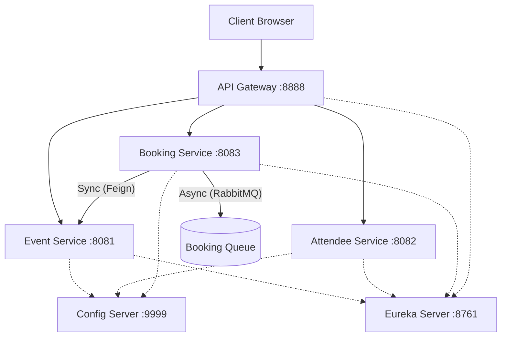
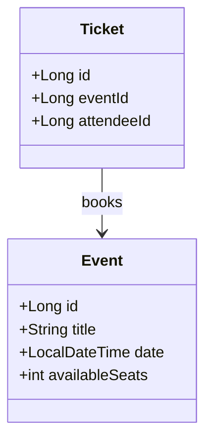

# 🎟️ Event Ticket Booking Microservices

A robust, scalable microservices-based application for managing events, attendees, and ticket bookings. Built with **Spring Boot** and **Spring Cloud**, featuring synchronous communication (Feign) and asynchronous messaging (RabbitMQ).


## 🏗️ Architecture

The system consists of three functional microservices and three infrastructure services:



## 🚀 Services Overview

| Service               | Port   | Description                                            | DB (H2)      |
| :-------------------- | :----- | :----------------------------------------------------- | :----------- |
| **Discovery Service** | `8761` | Eureka Server for service registration & discovery.    | N/A          |
| **Config Service**    | `9999` | Centralized configuration server.                      | N/A          |
| **Gateway Service**   | `8888` | Spring Cloud Gateway acting as the single entry point. | N/A          |
| **Event Service**     | `8081` | Manages event details and seat availability.           | `evenbdb`    |
| **Attendee Service**  | `8082` | Manages user/attendee registration.                    | `attendeedb` |
| **Booking Service**   | `8083` | Handles booking logic and notifications.               | `bookingdb`  |

## 🛠️ Tech Stack

- **Core:** Java 17, Spring Boot 3
- **Discovery:** Netflix Eureka
- **Routing:** Spring Cloud Gateway
- **Communication:** OpenFeign (Sync), Spring AMQP / RabbitMQ (Async)
- **Database:** H2 In-Memory Database
- **Frontend:** HTML5, Bootstrap 5, Vanilla JS

## 📦 Prerequisites

- Java Development Kit (JDK) 17+
- Maven 3.x
- RabbitMQ (Running on `localhost:5672`)
  - _Note: The application has error handling to continue even if RabbitMQ is down._

## 🏁 Getting Started

### 1. Clone the Repository

```bash
git clone https://github.com/event-ticket-booking.git
cd event-ticket-booking
```

### 2. Start Infrastructure Services (Order Matters)

Open separate terminals for each:

1.  **Config Service**
    ```bash
    mvn spring-boot:run -f config-service
    ```
2.  **Discovery Service** (Wait for Config to start)
    ```bash
    mvn spring-boot:run -f discovery-service
    ```
3.  **Gateway Service**
    ```bash
    mvn spring-boot:run -f gateway-service
    ```

### 3. Start Microservices

1.  **Event Service**
    ```bash
    mvn spring-boot:run -f event-service
    ```
2.  **Attendee Service**
    ```bash
    mvn spring-boot:run -f attendee-service
    ```
3.  **Booking Service**
    ```bash
    mvn spring-boot:run -f booking-service
    ```

### 4. Access the Application

- **Frontend UI:** Open your browser to `http://localhost:8888/index.html`
- **Eureka Dashboard:** `http://localhost:8761`

## 🔌 API Reference

| Service      | Method | Endpoint                          | Description       |
| :----------- | :----- | :-------------------------------- | :---------------- |
| **Event**    | `GET`  | `/event-service/api/events`       | List all events   |
| **Event**    | `POST` | `/event-service/api/events`       | Create an event   |
| **Attendee** | `POST` | `/attendee-service/api/attendees` | Register attendee |
| **Booking**  | `POST` | `/booking-service/api/bookings`   | Book a ticket     |

## 📊 Class Diagram



## 👤 Author

- **Name:** Chiheb Kammoun - EPI DIGITAL SCHOOL
